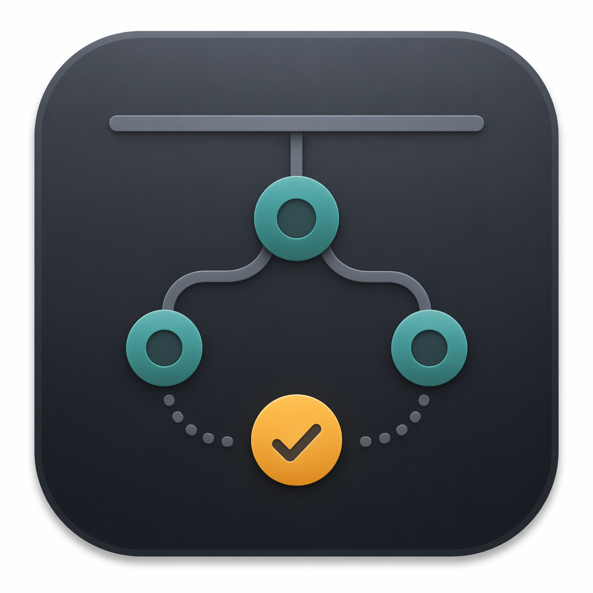

<p align="center">
  
</p>

# TinkerBar

TinkerBar is a small macOS menu bar app for personal automations that are too useful to forget, but too small to deserve a whole app of their own.

Each automation lives in a folder with a `task.json` file and a `run.sh` script. TinkerBar runs the script when a folder changes, a timer fires, or an app opens or quits. From the menu bar, you can turn tasks on and off, run or stop them by hand, and open their folders and logs.

The workers remain ordinary shell scripts, so they are easy to inspect, replace, or delete.

## How it works

TinkerBar discovers sibling task folders under:

```text
~/Library/Application Support/TinkerBar/tasks/
```

It supports folder, interval, and application triggers. TinkerBar owns the scheduling and worker lifecycle, including status refreshes, a 30-minute deadline, cancellation, and process cleanup. Each task keeps its current state in `status.tsv` and writes worker output to `task.log`.

Directory and interval tasks wait during quiet hours, from 1:00 to 8:00 a.m. Manual runs and application events still work during that time.

## Getting started

TinkerBar requires macOS 13 or later and a Swift 6 toolchain. Clone the repository and run it from the project root:

```bash
swift run
```

To build a standalone app bundle:

```bash
./scripts/build-app.sh
open dist/TinkerBar.app
```

For a local install, the build script can replace the copy in `~/Applications`, relaunch it, and verify the running executable:

```bash
./scripts/build-app.sh --install
```

Set `TINKERBAR_INSTALL_DIR` if you use a different local install directory. The bundle is ad-hoc signed for local use; distribution to other Macs requires Developer ID signing and notarization.

Use `Reload Tasks` after editing a task, `Open Tasks Folder` to inspect the live files, and `Start at Login` if you want TinkerBar to launch with macOS.

## Built-in tasks

TinkerBar started as a home for a few automations I use on my own Macs, so the bundled tasks are intentionally specific:

- `heic-to-jpeg` converts new HEIC or HEIF files in a watched folder to JPEG.
- `codex-update` periodically updates the global Codex CLI with npm.
- `codex-usage-ledger` records estimated Standard-tier API-equivalent Codex cost locally and can collect from configured remote hosts.
- `parsec-macmini-mirror` mirrors local Parsec launch and quit events to a configured Mac mini.

On first launch, TinkerBar creates these four task folders. They begin turned off, so nothing runs until you enable it from the menu. Built-in tasks use the same folder format as custom tasks.

## Creating a task

A task folder contains two files you provide and two files TinkerBar maintains:

```text
my-task/
  task.json
  run.sh
  status.tsv
  task.log
```

- `task.json` describes the task and its trigger.
- `run.sh` is the worker script.
- `status.tsv` stores the latest run state.
- `task.log` stores worker output.

For example, a folder-triggered task can use this configuration:

```json
{
  "id": "downloads-cleanup",
  "name": "Downloads cleanup",
  "detail": "Organize new files in Downloads.",
  "triggerKind": "directory",
  "directoryPath": "~/Downloads",
  "openPath": "~/Downloads"
}
```

Supported trigger kinds:

- `directory` runs when new regular files appear in `directoryPath`.
- `interval` runs every `intervalSeconds`.
- `application` runs when the configured `applicationName` or `bundleIdentifier` opens or quits.

TinkerBar calls each script with arguments for its trigger type:

```text
Directory:   run.sh <directoryPath> <statusFile> <logFile>
Interval:    run.sh <statusFile> <logFile>
Application: run.sh <opened|closed|sync> <statusFile> <logFile>
```

A nonzero exit status or a nonempty `last_error` value marks the run as failed. TinkerBar also records runner-level failures such as timeouts in `status.tsv`.

## Private task configuration

Keep secrets and machine-specific values outside the repository. The Codex usage task, for example, reads an optional `config.env` from its runtime folder:

```text
~/Library/Application Support/TinkerBar/tasks/codex-usage-ledger/config.env
```

See [Codex usage ledger](docs/codex-usage.md) for configuration and an explanation of the estimates.

## Development

TinkerBar is a SwiftPM macOS app. Source lives in `Sources/TinkerBar/`, bundled worker scripts live in `Sources/TinkerBar/Resources/BuiltinTasks/`, and the bundle builder lives at `scripts/build-app.sh`.

Useful commands:

```bash
swift build
swift test -Xswiftc -strict-concurrency=complete -Xswiftc -warnings-as-errors
swift run
./scripts/build-app.sh
./scripts/build-app.sh --install
```

For behavior changes, build the app and exercise the affected task from the menu bar. For task-format changes, verify the relevant directory, interval, or application script contract.
