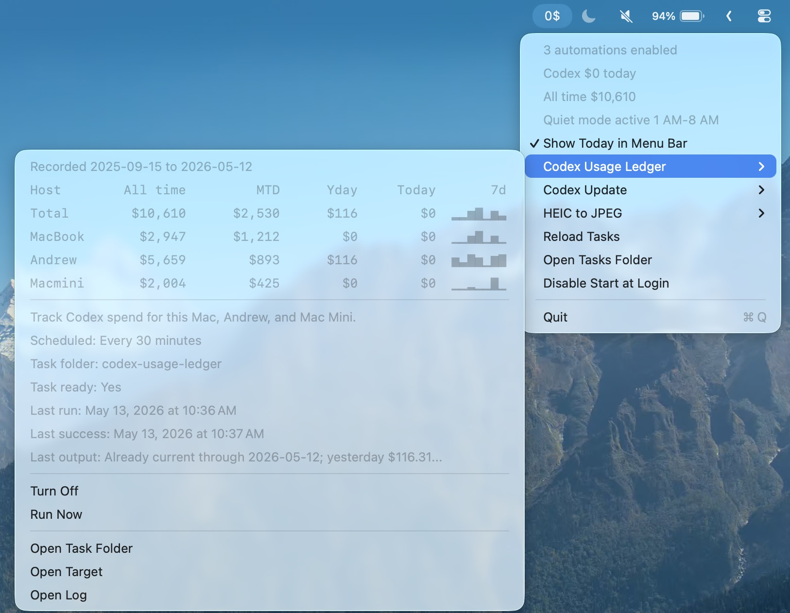

<p align="center">
  
</p>

# TinkerBar

TinkerBar is a small macOS menu bar app for personal automations that are too useful to forget, but too small to deserve a whole app of their own.

<p align="center">
  
</p>

It watches a folder of task definitions, shows their status in the menu bar, and runs each task's `run.sh` either on a schedule or when files appear in a watched folder. The app handles the menu, scheduling, launch-at-login, status refreshes, and log shortcuts; each worker stays as a plain shell script that is easy to read, replace, or delete.

## Highlights

- Menu bar controls for turning tasks on or off, running them manually, and opening their folders or logs.
- Folder-triggered tasks for workflows like converting new camera files.
- Interval-triggered tasks for recurring maintenance jobs.
- File-based task folders, so custom automations are easy to inspect and move around.
- Quiet overnight behavior for automatic runs, while manual runs still work when you ask for them.
- No third-party watcher daemon or long-running shell script hidden in the background.

## Built-In Tasks

TinkerBar currently ships with three example tasks:

- `heic-to-jpeg`: converts new HEIC or HEIF files in a watched folder to JPEG.
- `codex-update`: periodically updates the global Codex CLI with npm.
- `codex-usage-ledger`: tracks Codex usage into a local ledger and summary file. Remote hosts are optional and configured outside the repo.

Each built-in task is installed into the same task-folder format that custom tasks use.

## Getting Started

Clone the repo, then run the app from the project root:

```bash
swift run
```

To build a standalone app bundle:

```bash
./scripts/build-app.sh
open dist/TinkerBar.app
```

From the menu bar, use `Reload Tasks` after editing task files, `Open Tasks Folder` to inspect the live task directory, and `Start at Login` if you want TinkerBar to keep working after you restart your Mac.

## Task Folders

Runtime task data lives outside the repo:

```text
~/Library/Application Support/TinkerBar/tasks/
  heic-to-jpeg/
    task.json
    run.sh
    status.tsv
    task.log
  codex-update/
    task.json
    run.sh
    status.tsv
    task.log
```

The app discovers sibling folders under `tasks/`. A task is ready when it has:

- `task.json` describing the task.
- `run.sh` containing the worker script.
- `status.tsv` for the latest run state.
- `task.log` for script output.

## Task Configuration

A folder-triggered task looks like this:

```json
{
  "id": "heic-to-jpeg",
  "name": "HEIC to JPEG",
  "detail": "Convert new HEIC and HEIF files in a folder to JPEG.",
  "scriptKind": "heic_to_jpeg",
  "triggerKind": "directory",
  "directoryPath": "~/Downloads",
  "openPath": "~/Downloads"
}
```

Supported trigger kinds:

- `directory`: runs when new regular files appear in `directoryPath`.
- `interval`: runs every `intervalSeconds`.

Script argument contracts:

- Directory task: `run.sh <directoryPath> <statusFile> <logFile>`
- Interval task: `run.sh <statusFile> <logFile>`

## Private Task Config

The bundled Codex usage task reads an optional private env file from its runtime task folder:

```text
~/Library/Application Support/TinkerBar/tasks/codex-usage-ledger/config.env
```

Example:

```zsh
TINKERBAR_CODEX_USAGE_REMOTE_HOSTS="workstation server"
TINKERBAR_CODEX_USAGE_TIMEZONE="America/Los_Angeles"
```

Keep that file out of Git. You can also point at another private config path with `TINKERBAR_CODEX_USAGE_CONFIG_FILE`.

## Development

TinkerBar is a SwiftPM macOS app. Source lives in `Sources/TinkerBar/`, bundled worker scripts live in `Sources/TinkerBar/Resources/BuiltinTasks/`, and the bundle builder lives at `scripts/build-app.sh`.

Useful commands:

```bash
swift build
swift test
swift run
./scripts/build-app.sh
```

For behavior changes, build the app, launch it, and exercise the affected task from the menu bar. For task-format changes, make sure both directory and interval task argument contracts still work.
